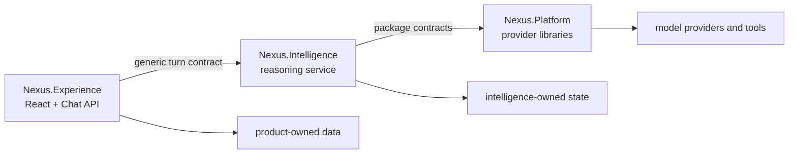

# Nexus architecture and readiness audit

**Audit date:** 2026-08-25  
**Scope:** `Nexus.Platform`, `Nexus.Intelligence`, `Nexus.Experience` archives supplied on 2026-08-25  
**Architecture baseline:** Nexus master architecture and roadmap v2.2

## Executive verdict

The three-way direction is approved:

> Products own their data and experience. Intelligence decides. Platform executes.

The boundaries are substantially better than the old combined backend and are the correct
foundation for additional Nexus products. The implementation is nevertheless transitional,
not production-ready, and only conditionally future-proof. The principal blockers are missing
identity and service trust, volatile Intelligence state, incomplete SQL migration, weak package
release reproducibility, incomplete boundary tests, and an orchestration/tool layer that remains
mostly skeletal.

The recommendation is to keep the architecture, complete the stabilization gate, and build
autonomous development through the approved Layer 07 repository, `Nexus.Developer`. Do not
create a competing `Nexus.Development` namespace or move product/CI/provider responsibilities
into Layer 07.

## Current architecture

`Nexus.Platform` is a set of packages, not a separately deployed service. `Nexus.Intelligence`
is the deployed decision/orchestration service. `Nexus.Experience` currently contains the Chat
product API, domain and web experience.

## Repository assessment

| Repository | What is right | Current limitation | Verdict |
|---|---|---|---|
| `Nexus.Platform` | Provider contracts, routing seam, model catalogue and product isolation | Usage is in-memory, quota is permissive, audit is console-only, cost is zero, tool catalogue is empty | Correct boundary; governance not production-grade |
| `Nexus.Intelligence` | Generic context/turn contracts, pipeline stages, memory abstraction, separate API | No authentication, volatile memory/traces/results, stub developer agent, no usable tools | Strong seam; runtime durability and autonomy incomplete |
| `Nexus.Experience` | Product owns domain/data/UI; Chat UI now exists; API versions are explicit | Identity is hardcoded, SQL migration is partial, service call is unauthenticated, health route is wrong | Correct product boundary; transitional implementation |

## Ownership now and target ownership

| Concern/entity | Current owner | v2.2 target owner | Required action |
|---|---|---|---|
| Workspace, Project | Experience/Chat | Layer 06 Product Core | Move only after persistence stabilization |
| Conversation, Message | Experience/Chat | Layer 11 Experience | Extract after stable contracts exist |
| Knowledge, ADR | Experience/Chat | Layer 02 Data | Create governed data contracts first |
| WorkItem | Experience/Chat | Layer 07 Developer | Import at `M-07-1.1` into the work graph |
| Artifact | Experience/Chat | Layers 07/08 split | Split intent/metadata from delivery output |
| Branch, Snapshot | Experience/Chat | Layer 08 Delivery | Move with build/source-control contracts |
| Session | Experience/Chat | Layers 01/07 split | Separate identity/runtime session from development session |
| Model/provider execution | Platform packages | Layer 04 AI/platform capability | Keep out of product and Developer implementations |

This migration should be staged. Moving entities before their target contracts and durable
stores exist would trade one form of coupling for another.

## Future-proofing assessment

| Area | Current state | Future-proof condition |
|---|---|---|
| Product expansion | Generic Intelligence input avoids Chat-domain dependencies | Enforce this with complete architecture tests |
| Provider expansion | Gateway/catalogue abstractions exist | Pin versioned contracts; implement real cost, quota and audit |
| Data evolution | Repository abstractions exist | Finish SQL migration and remove dual Dataverse/SQL truth |
| Security | Development placeholder identity | Entra/user authentication, tenant authorization and service-to-service trust |
| Reliability | Turn state and governance are volatile | Durable memory, trace, result, usage and audit stores; idempotent turns/outbox |
| Delivery | GitHub workflows and package feed configuration exist | Deterministic versions, exact package references and a single clean build/release path |
| Autonomous development | Roadmap describes the complete Layer 07 path | Safe graph, reservations, isolated workers, verification and human integration gates |
| Operability | Health endpoints and logging exist | Correct health routing, rate limits, telemetry, recovery and deployment evidence |

The design is future-proof only if these conditions are treated as release gates rather than
optional later enhancements.

## High-priority findings

1. **Authentication and tenant authorization are absent.** The Chat turn identity uses a
   hardcoded tenant, empty user id and fixed permission. Endpoints do not enforce a real actor.
2. **Experience-to-Intelligence trust is absent.** The HTTP call has no service credential or
   signed tenant/user context.
3. **Intelligence state is volatile.** Memory, traces, reports and usage disappear on restart.
4. **Governance is non-enforcing.** Quotas allow everything, audit is console-only and model
   cost records zero.
5. **Autonomous execution is not implemented.** The developer agent is a stub and the tool
   gateway/catalogue contains no usable execution path.
6. **Persistence is split.** Only Workspace is migrated to SQL; remaining Chat aggregates use
   Dataverse.
7. **The frontend health check is incorrect.** The client prefixes `/api/v1`, while the backend
   maps health at `/health`.
8. **Turn persistence is not atomic.** A user message is saved before the Intelligence request;
   failure/retry can leave an unmatched or duplicate logical turn. Add an idempotency key and
   durable turn/outbox state.
9. **Package consumption is not reproducible enough.** Internal packages use floating
   `0.1.0-*` references and publication remains partly manual.
10. **Tests do not cover the full boundary.** There are 36 xUnit Fact/Theory declarations, but
    no full API/database/turn-pipeline/browser end-to-end test.
11. **Architecture guards are incomplete.** Platform tests omit several assemblies and still
    cite the older architecture document rather than all v2.2 boundaries.
12. **Operational defaults are development-grade.** Swagger is enabled in every environment,
    hosts are unrestricted and rate limiting is absent.
13. **Documentation disagrees with the code.** Current-state/readme documents still claim that
    CI or GitHub Packages are absent even though workflow and feed files are present.
14. **Repository hygiene needs tightening.** Local settings/user environment artifacts are
    included in the archives.

## Roadmap and control validation

The supplied v2.2 roadmap is structurally sound:

- 614 unique source nodes: 12 layers, 90 features, 151 milestones, 108 work items,
  140 tasks and 113 subtasks;
- 206 dependency references resolve;
- no dependency cycle was found;
- required milestone fields are populated.

The control workbook adds 11 temporary, versioned control nodes for the audit, ledger,
preflight and DevTools transition. Its current view therefore contains 625 rows and
152 milestones. These temporary nodes can be imported into the permanent work graph at
`M-07-1.1`.

## Development control introduced

`NEXUS_DEVELOPMENT_CONTROL_v1.0.xlsx` contains:

- **Control Center:** release/phase status, metrics and milestone chart;
- **Master Roadmap:** append-only Layer → Feature → Milestone → WorkItem → Task → Subtask graph;
- **Active Changes:** concurrent worker, file, project, schema and contract reservations;
- **Audit Findings:** risk, evidence, action and target node;
- **Session Protocol:** mandatory read, preflight, reservation, verification and closeout rules.

Parent progress is formula-derived only when `Breakdown Complete = Yes`; otherwise it is
reported as not estimable. Governed changes append a higher record version and retire the old
row from the current view. The workbook and machine-readable mirrors must be updated together.

## Safe autonomous-development ladder

Autonomy should be earned in this order:

1. **Control now:** read workbook/mirrors, declare exact scope, preflight and reserve.
2. **Work graph (`M-07-1.1`):** persist releases, milestones, features and executable work.
3. **Safety (`M-07-2.2`):** deterministic dependency, overlap and architecture checks.
4. **Isolation (`M-07-3.1`):** one worker, branch and sibling worktree per WorkItem.
5. **Verification (`M-07-4.1`):** ingest build, test, lint, architecture and security evidence.
6. **Human gate (`M-07-5.1`/`M-07-5.3`):** require recorded review before integration.
7. **Dispatch (`M-07-3.2`):** enable unattended dispatch only after all prior gates are proven.

The delivered bootstrap automates stages 1's temporary predecessor: scope comparison,
reservation, evidence completion and a safe DevTools import. It intentionally does not grant an
agent unrestricted filesystem, git, schema or deployment authority.

## Nexus.Developer and DevTools migration

The architecture-approved Layer 07 name is `Nexus.Developer`; that name is retained. The
bootstrap does not create empty .NET projects. The approved projects are created with working
behavior at `M-07-1.1`.

The legacy DevTools files were not present in any of the three supplied archives. Actual source
rework would therefore require guessing and is not performed. The migration script validates
all required files, copies them to the Layer 07 bootstrap, verifies SHA-256 equality and leaves
the source untouched. After import, hard-coded local paths should be reworked behind one
configuration boundary while preserving the current shell behavior.

The common WPF/PowerShell shell remains a launcher/client. Provider, data, CI, product and
other layer-owned implementations stay in their owning repositories.

## Recommended implementation order

1. Correct `CURRENT_STATE.md`, repository hygiene and the frontend health route.
2. Make package publication deterministic and replace floating internal references.
3. Implement user authentication, tenant authorization and service-to-service trust.
4. Complete SQL migration and remove split persistence truth.
5. Persist Intelligence memory, traces, reports, usage and audit; add idempotent turn handling.
6. Add API integration tests and one full fake-provider end-to-end path.
7. Strengthen v2.2 boundary tests across every assembly.
8. Build the Layer 07 work graph and import this workbook.
9. Add isolated execution, verification ingestion and human-gated integration.
10. Enable autonomous dispatch only after the preceding gates pass.

## Verification limits

This audit includes source, dependency, architecture, roadmap and workbook validation. The .NET
SDK is not installed in the inspection environment, so `dotnet build` and `dotnet test` could
not be executed here. Frontend installation did not complete because the sandbox npm cache/tar
extraction failed, so no frontend green-build claim is made. The ZIPs contain workflows but no
git history, branch-protection state or successful hosted-run evidence. A clean CI run remains
part of the stabilization gate.

No original archive was modified.
